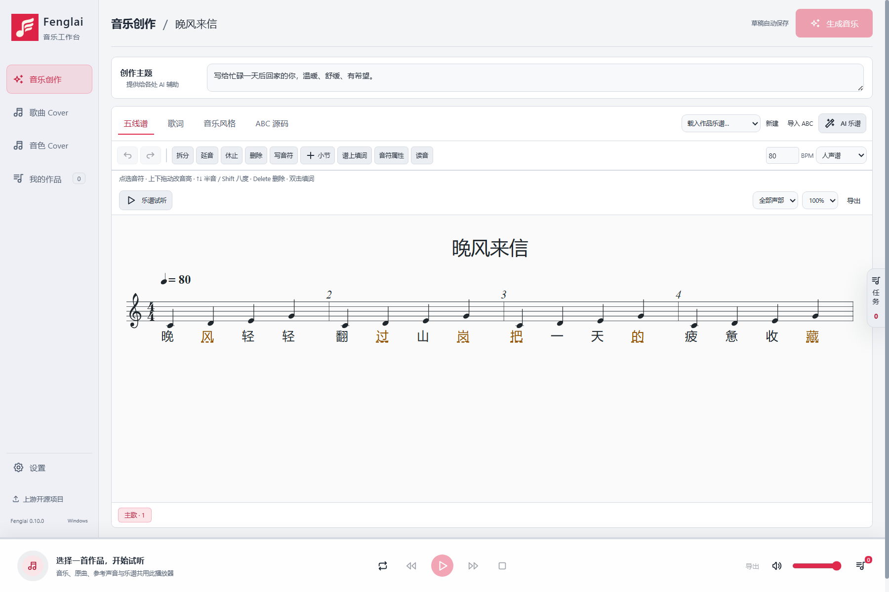

# Fenglai 音乐工作台

<p align="center"></p>
<p align="center"><strong>从创作主题、歌词和乐谱，到本地生成与翻唱。</strong></p>
<p align="center">简体中文 · <a href="README.en.md">English</a> · <a href="docs/SHOWCASE.zh-CN.md">软件展示</a></p>

Fenglai 是基于 YuE2 的 Windows 桌面音乐工作台，将音乐创作、歌曲改编、音色转换、可视化乐谱和播放整合在同一个界面。这是独立适配项目，不是 YuE 官方桌面发行版。



## 功能

### 0.11.0：纯音乐与器乐 Cover

音乐创作和歌曲 Cover 新增「歌曲 / 纯音乐」输出选择。纯音乐模式保留歌词草稿但不用于演唱：已有谱由官方工具将旋律转入器乐声部；没有谱则由 YuE2 先写谱。支持保留参考和声，沿用 Windows 单卡环境，无需更换模型。官方音乐 Skill 更新至 **1.2.0 / 72272f9**；推理引擎保持当前固定版本。详见 [更新与验证范围](docs/INSTRUMENTAL-0.11.0.md)。

| 工作区 | 能力 |
| --- | --- |
| 音乐创作 | 输入主题、风格、歌词与 ABC 乐谱；在各字段内使用 DeepSeek 辅助创作 |
| 可视化乐谱 | 编辑音高、时值、休止、连音和小节；直接填词、撤销与重做；多音字标记及同音字引导 |
| 歌曲 Cover | 拖动波形选段、提取乐谱；曲风/歌词改编、只改词不改谱、改词改谱三种模式 |
| 音色 Cover | 上传目标声音，或选择女声、男声、男童、女童、老人预设；支持 AI 音色设计 |
| 歌词与同步 | 千问 ASR 识别歌词；生成后自动对齐时间，成品播放跟随乐谱 |
| 播放与作品 | 全局播放器、顶边悬停进度条、独立滚动歌词、作品历史、导出与任务侧栏 |
| 设置 | 单张 NVIDIA 显卡检测与选择、环境状态、缺失组件安装、主题/强调色/自定义背景 |

查看 [中文软件展示](docs/SHOWCASE.zh-CN.md) / [English showcase](docs/SHOWCASE.en.md)。截图使用演示草稿，不包含私人作品和账户资料。

## 从源码启动

仓库提供源码与必要的前端资源，**不包含模型权重、Python 环境或完整离线安装包**。

准备 Windows 10/11 x64、Node.js 24、npm 和 Git：

```powershell
git clone https://github.com/FengLairh/Fenglai-Music-Studio.git
cd Fenglai-Music-Studio
npm ci
node scripts/bootstrap-tools.cjs
npm start
```

打开「设置」，检测显卡并安装缺失的环境和模型；首次安装需要联网及足够的磁盘空间。然后在音乐创作中输入内容，或在 Cover 页面导入音频。

音频模型在本机执行，使用所选单卡，不合并多卡显存。显存需求随模型、时长与配置变化；界面可独立打开，生成则需要兼容的 NVIDIA CUDA 环境。安装完成并不等于所有生成场景都已在当前硬件验证。

DeepSeek 是可选云端助手，需要自行配置官方 API Key。调用时发送相关文字、乐谱和创作要求，不向 DeepSeek 上传原始音频。环境安装、模型下载及云端助手仍需要网络。界面当前以中文为主。

## 能力边界

- 「只改词，不改谱」锁定乐谱、采用原曲风格，忽略新的音乐风格；仍会重新生成音频，不保证保留原伴奏波形或原歌手音色。
- 音色 Cover 通过独立声音转换模型处理人声并混回伴奏。效果取决于分离和参考录音，可能有噪声或原声音色残留。
- 音频/乐谱对齐为自动估计，不可靠的位置不会强行高亮，支持手动校正。
- 多音字使用经确认的同音字引导生成，不是强制拼音控制，仍需试听核对。

## 开发

```powershell
npm test
npm run dist
```

默认测试不需要模型权重，不代表真实 GPU 生成或演唱质量验收。打包前运行工具初始化脚本。桌面与音频集成测试需要额外环境及测试素材，不属于干净克隆的默认测试要求。

| 目录 | 内容 |
| --- | --- |
| ui/ | 桌面界面与乐谱编辑器 |
| desktop/ | Electron 主进程、任务与本地服务 |
| backend/ | Python 音频适配器 |
| vendor/ | 固定上游源码和官方音乐 Skill 快照 |
| licenses/ | 第三方许可说明 |
| *.lock.json | 固定模型版本与文件校验 |

运行数据默认保存在应用旁的 `data/`，可用 `YUE_DATA_DIR` 指定。不要提交作品、草稿、音频、模型、环境或凭据。完整离线包需另外准备全部相关模型与环境；仓库不宣称已提供可下载的离线发行版。

## 上游与许可

- YuE 固定源码：`88da114a67df892af0329472073b96a5ef700b93`；官方音乐 Skill 来源见 `vendor/yue2-music-skill/skill.lock.json`。
- 桌面适配代码：[Apache-2.0](LICENSE)。第三方代码和模型保留各自许可。
- 固定快照中的 YuE2 / SheetSage2 / MERT 权重采用非商业条款，详见 [模型许可](licenses/YuE2-MODEL_LICENSE) 和模型锁文件；源码许可不授予权重商业使用权。
- Seed-VC 及 `backend/voice.py` 使用 GPL-3.0 系列许可，见 [音色组件说明](licenses/VOICE-THIRD-PARTY.md)。
- 歌词转写使用千问 ASR；Seed-VC 内部另有 Whisper 内容编码器，它不用于歌词转写。

感谢 [YuE](https://github.com/multimodal-art-projection/YuE)、Seed-VC、Qwen、DeepSeek、ABCJS、Electron 等上游项目。完整声明见 [licenses/](licenses/) 和上游快照。

