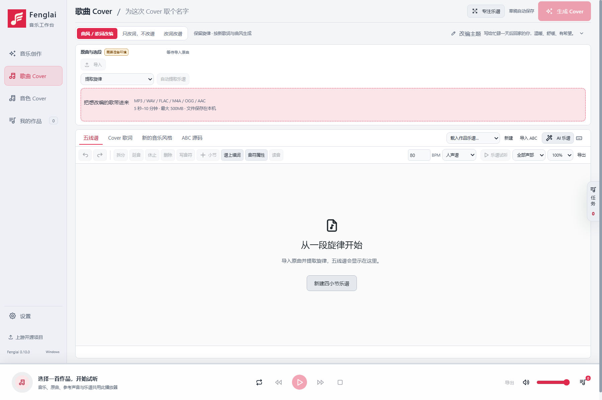
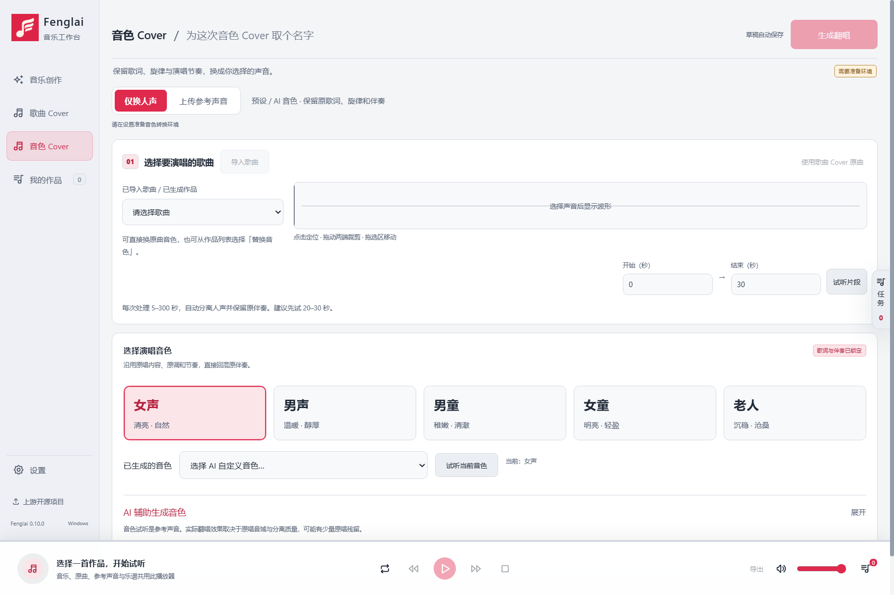
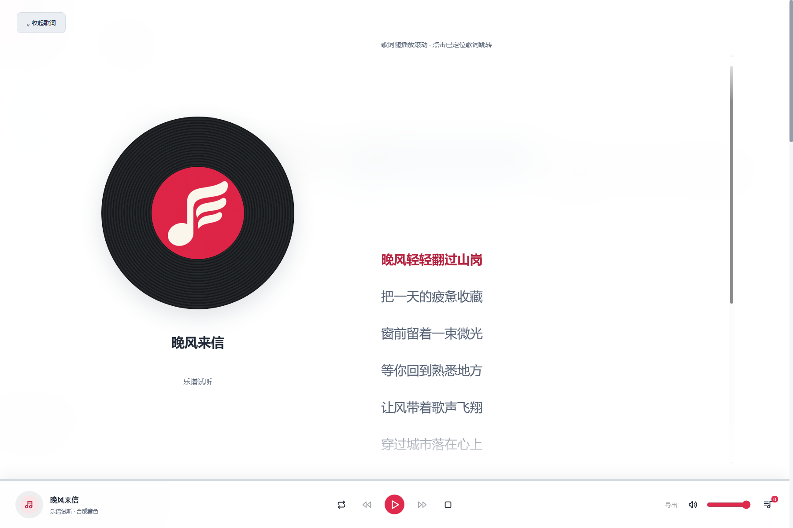
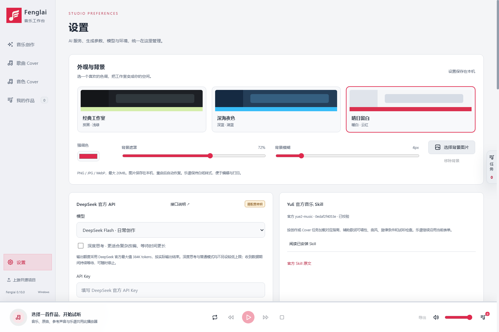

# 软件展示

[返回中文首页](../README.md) · [English](SHOWCASE.en.md)

以下为真实桌面界面截图，使用独立演示草稿。演示环境未安装模型，所以部分生成按钮显示为不可用；截图用于展示交互布局，不作为生成质量证明。

## 音乐创作
主题、歌词、音乐风格与五线谱集中在工作台，AI 在相应字段内辅助填写。谱上可直接编辑音符与歌词。

## 歌曲 Cover
三种改编范围明确分开：曲风/歌词改编、只改词不改谱、改词改谱。导入音频后可在波形上选段，再提取与编辑乐谱。

## 音色 Cover
预设人声与上传目标声音集中在音色工作区，转换参数与参考声音在此管理。

## 独立歌词播放器
点击底部左侧歌曲信息，向上展开歌词视图。进度条固定在播放器顶边，悬停时显示拖动点和时间。已经获得可靠时间定位的歌词可跟随与点击跳转。

## 设置
主题、背景、显卡选择和本地环境统一管理。已安装组件显示状态；缺失组件保留安装入口。

